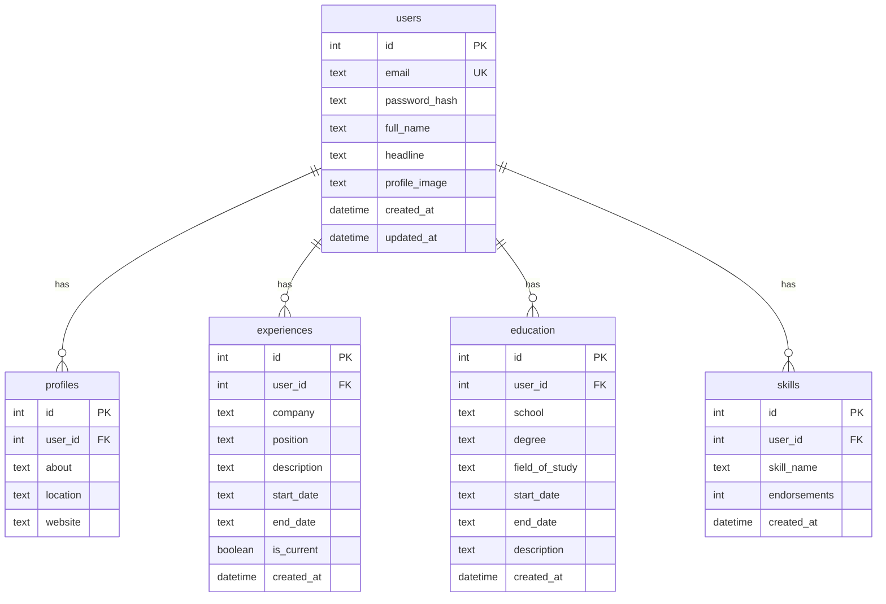
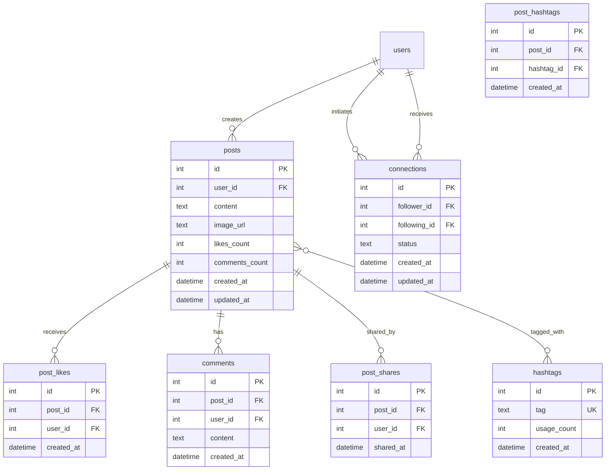
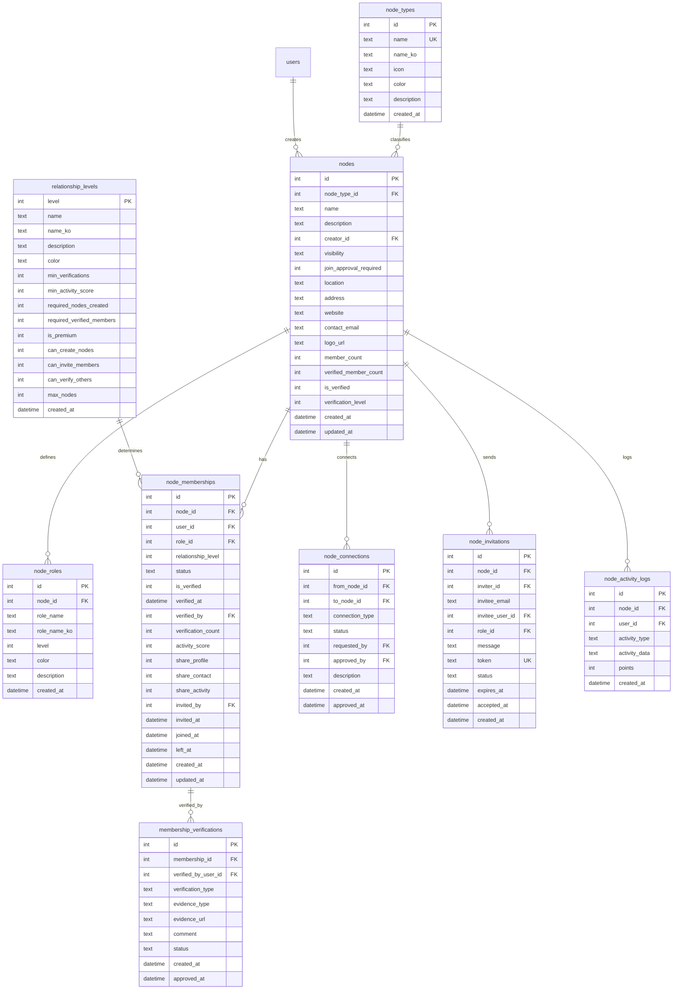
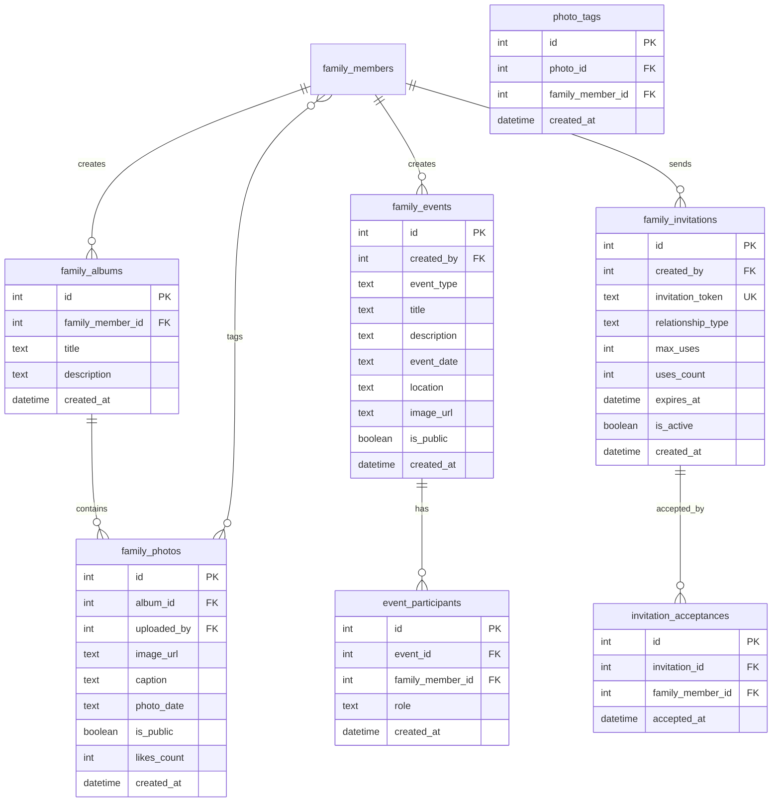
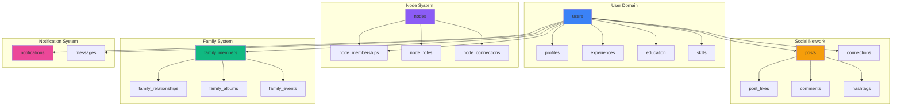

# CHON-Network Entity Relationship Diagram (ERD)

## 📐 ERD 개요

이 문서는 CHON-Network 플랫폼의 데이터베이스 구조를 시각적으로 표현한 ERD입니다.

---

## 🎨 전체 시스템 ERD (Mermaid)

### 1. 사용자 & 프로필 시스템



### 2. 소셜 네트워크 시스템



### 3. 노드 확장 시스템



### 4. 가족 트리 시스템

```mermaid
erDiagram
    users ||--o| family_members : is
    family_members ||--o{ family_relationships : has
    family_members ||--o{ contact_info : has
    family_members ||--o{ marriage_events : participates
    family_members ||--|| family_profiles : has
    family_members ||--o{ privacy_settings : configures
    family_members ||--o{ relationship_verifications : requests
    
    family_members {
        int id PK
        int user_id FK_UK
        text name_ko
        text name_en
        text birth_date
        text gender
        boolean is_alive
        boolean is_registered
        int created_by FK
        datetime created_at
        datetime updated_at
    }
    
    family_relationships {
        int id PK
        int person_id FK
        int relative_id FK
        text relationship_type
        boolean is_verified
        datetime created_at
    }
    
    contact_info {
        int id PK
        int family_member_id FK
        text contact_type
        text contact_value
        boolean is_primary
        datetime created_at
    }
    
    marriage_events {
        int id PK
        int person_id FK
        int spouse_id FK
        text marriage_date
        boolean is_verified
        datetime created_at
    }
    
    family_profiles {
        int id PK
        int family_member_id FK_UK
        text occupation
        text education
        text bio
        text profile_image
        boolean is_public
        datetime created_at
        datetime updated_at
    }
    
    privacy_settings {
        int id PK
        int family_member_id FK
        text field_name
        boolean is_visible
    }
    
    relationship_verifications {
        int id PK
        int requester_id FK
        int target_id FK
        text relationship_type
        text status
        text verification_code
        datetime created_at
        datetime responded_at
    }
```

### 5. 가족 고급 기능



### 6. 알림 & 메시징 시스템

```mermaid
erDiagram
    users ||--o{ notifications : receives
    users ||--|| notification_preferences : has
    users ||--o{ messages : sends
    users ||--o{ messages : receives
    users ||--o{ search_history : performs
    
    notifications {
        int id PK
        int user_id FK
        text type
        text title
        text message
        int related_id
        text related_type
        boolean is_read
        datetime created_at
    }
    
    notification_preferences {
        int id PK
        int user_id FK_UK
        boolean connection_requests
        boolean post_interactions
        boolean node_activities
        boolean family_updates
        boolean event_reminders
        boolean mentions
        boolean email_notifications
        datetime created_at
        datetime updated_at
    }
    
    messages {
        int id PK
        int sender_id FK
        int receiver_id FK
        text content
        boolean is_read
        datetime created_at
    }
    
    search_history {
        int id PK
        int user_id FK
        text search_query
        text search_type
        datetime created_at
    }
```

---

## 🔗 시스템 간 통합 관계



---

## 📊 주요 관계 타입

### One-to-One (1:1)
- users ↔ family_members
- users ↔ notification_preferences
- family_members ↔ family_profiles

### One-to-Many (1:N)
- users → posts
- users → experiences
- users → education
- users → skills
- nodes → node_memberships
- nodes → node_roles
- family_members → family_albums
- family_albums → family_photos

### Many-to-Many (M:N)
- users ↔ users (connections)
- posts ↔ hashtags (post_hashtags)
- nodes ↔ nodes (node_connections)
- family_members ↔ family_members (family_relationships)
- family_photos ↔ family_members (photo_tags)

### Self-Referencing
- connections (follower_id ↔ following_id)
- family_relationships (person_id ↔ relative_id)
- node_connections (from_node_id ↔ to_node_id)

---

## 🎯 관계 카디널리티 상세

### 사용자 관계
```
users (1) ←→ (1) profiles
users (1) ←→ (N) experiences
users (1) ←→ (N) education
users (1) ←→ (N) skills
users (1) ←→ (N) posts
users (M) ←→ (N) users (connections)
users (1) ←→ (N) node_memberships
users (1) ←→ (0..1) family_members
users (1) ←→ (N) notifications
users (1) ←→ (1) notification_preferences
```

### 노드 관계
```
node_types (1) ←→ (N) nodes
users (1) ←→ (N) nodes (creator)
nodes (1) ←→ (N) node_memberships
nodes (1) ←→ (N) node_roles
nodes (M) ←→ (N) nodes (node_connections)
nodes (1) ←→ (N) node_invitations
nodes (1) ←→ (N) node_activity_logs
```

### 가족 관계
```
users (1) ←→ (0..1) family_members
family_members (M) ←→ (N) family_members (relationships)
family_members (1) ←→ (N) contact_info
family_members (M) ←→ (N) family_members (marriage_events)
family_members (1) ←→ (1) family_profiles
family_members (1) ←→ (N) privacy_settings
family_members (1) ←→ (N) family_albums
family_members (1) ←→ (N) family_events
```

### 게시물 관계
```
posts (1) ←→ (N) post_likes
posts (1) ←→ (N) comments
posts (1) ←→ (N) post_shares
posts (M) ←→ (N) hashtags (post_hashtags)
```

---

## 🔑 Primary Keys & Foreign Keys 요약

### 단순 PK (AUTO_INCREMENT)
- 모든 테이블: `id INTEGER PRIMARY KEY AUTOINCREMENT`

### 특수 PK
- `relationship_levels`: `level INTEGER PRIMARY KEY` (1-5)
- `node_types`: 기본 데이터 포함 (1-6)

### 주요 FK 패턴
- `user_id`: 사용자 참조 (대부분 테이블)
- `node_id`: 노드 참조 (노드 시스템)
- `family_member_id`: 가족 구성원 참조 (가족 시스템)
- `post_id`: 게시물 참조 (소셜 네트워크)

### Cascade 규칙
- `ON DELETE CASCADE`: 부모 삭제 시 자식도 삭제
- `ON DELETE SET NULL`: 부모 삭제 시 FK를 NULL로 설정

---

## 📝 ERD 읽는 법

### 기호 설명
- `||`: One (정확히 하나)
- `o{`: Zero or More (0개 이상)
- `|{`: One or More (1개 이상)
- `||--||`: One-to-One
- `||--o{`: One-to-Many
- `}o--o{`: Many-to-Many

### 제약조건 약어
- **PK**: Primary Key
- **FK**: Foreign Key
- **UK**: Unique Key
- **FK_UK**: Foreign Key + Unique

---

## 🎨 시각화 도구

이 ERD는 Mermaid 문법으로 작성되었습니다:
- GitHub에서 자동 렌더링
- VSCode + Mermaid 플러그인
- 온라인: https://mermaid.live

---

**문서 생성일**: 2026-02-23  
**총 엔티티 수**: 44개  
**관계 타입**: 1:1 (3개), 1:N (40+개), M:N (5개)
